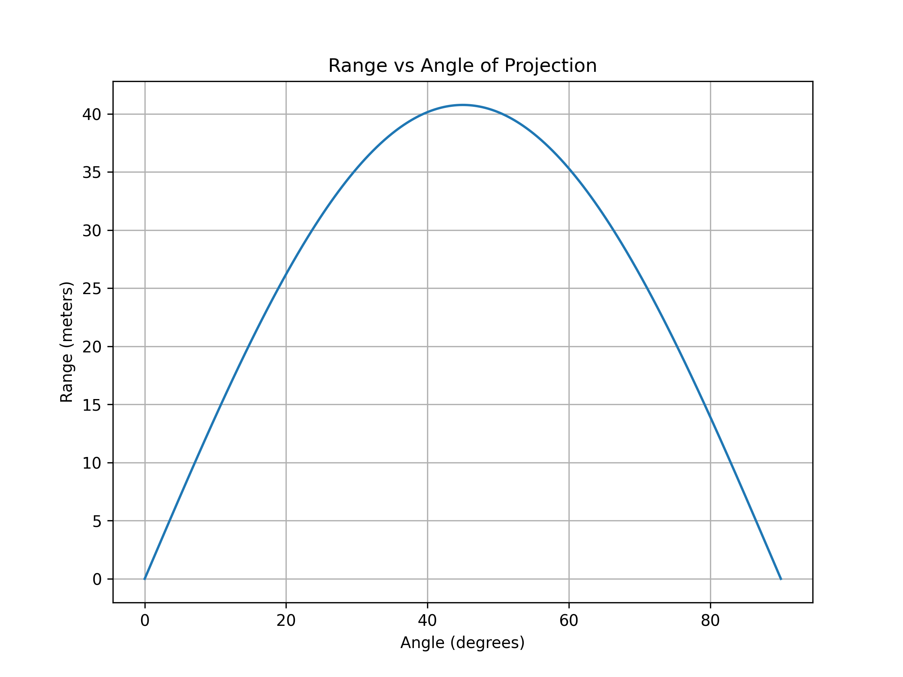

### **1. Theoretical Foundation**
#### **Governing Equations**
The motion of a projectile under gravity (without air resistance) is governed by Newton’s Second Law:

\[
\frac{d^2 x}{dt^2} = 0, \quad \frac{d^2 y}{dt^2} = -g
\]

Solving these, we get the velocity components:

\[
v_x = v_0 \cos\theta, \quad v_y = v_0 \sin\theta - gt
\]

And the position equations:

\[
x = v_0 \cos\theta \cdot t, \quad y = v_0 \sin\theta \cdot t - \frac{1}{2} g t^2
\]

where:
- \( v_0 \) is the initial velocity,
- \( \theta \) is the launch angle,
- \( g \) is the gravitational acceleration.

#### **Finding the Range**
The range \( R \) is found by solving for \( x \) when \( y = 0 \) (projectile returns to ground):

\[
t_f = \frac{2 v_0 \sin\theta}{g}
\]

Substituting into the equation for \( x \):

\[
R = v_0 \cos\theta \times \frac{2 v_0 \sin\theta}{g}
\]

Using the trigonometric identity \( 2 \sin\theta \cos\theta = \sin 2\theta \), we get:

\[
R = \frac{v_0^2}{g} \sin 2\theta
\]

This shows the range depends on \( \sin 2\theta \), with a maximum at \( \theta = 45^\circ \).

---

### **2. Analysis of the Range**
- The range is symmetric about \( \theta = 45^\circ \), meaning complementary angles (e.g., \( 30^\circ \) and \( 60^\circ \)) result in the same range.
- Increasing \( v_0 \) increases \( R \) quadratically.
- Increasing \( g \) (e.g., on different planets) decreases the range.

---

### **3. Practical Applications**
- **Sports:** Optimizing shot put, long jump, or soccer kicks.
- **Military:** Artillery calculations.
- **Space Science:** Designing launch angles for rockets.

Adding complexities like air resistance leads to asymmetric trajectories and reduced range.

---

### **4. Implementation in Python**
A simple simulation can use **NumPy** and **Matplotlib** to visualize the range:

```python
import numpy as np
import matplotlib.pyplot as plt

# Parameters
v0 = 20  # Initial velocity (m/s)
g = 9.81  # Gravitational acceleration (m/s^2)
angles = np.linspace(0, 90, 500)  # Angles in degrees

# Calculate range
ranges = (v0**2 * np.sin(2 * np.radians(angles))) / g

# Handle edge case where angle is 90 degrees
ranges[np.isclose(angles, 90)] = 0  # Set range to 0 for 90 degrees

# Plot
plt.figure(figsize=(8, 6))
plt.plot(angles, ranges)
plt.title("Range vs Angle of Projection")
plt.xlabel("Angle (degrees)")
plt.ylabel("Range (meters)")
plt.grid()

# Save the plot as an image
plt.savefig("range_vs_angle.png", dpi=300)  # Save as PNG with high resolution
plt.show()
```

### Graphical Representation

Below is the graph showing the relationship between the range and the angle of projection:

