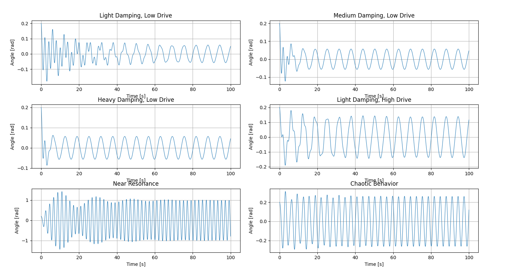

## Problem 2

### Investigating the Dynamics of a Forced Damped Pendulum

---

## 🧠 **General Solutions for the Forced Damped Pendulum**

### **1. Full Nonlinear Equation**

The forced damped pendulum is governed by the second-order nonlinear ODE:

\[
\frac{d^2\theta}{dt^2} + b\frac{d\theta}{dt} + \frac{g}{L}\sin(\theta) = A\cos(\omega_d t)
\]

This is **nonlinear**, **non-autonomous**, and **second-order**, with:
- **Damping**: \( b\frac{d\theta}{dt} \)
- **Restoring force**: \( \frac{g}{L} \sin(\theta) \)
- **External driving**: \( A\cos(\omega_d t) \)

❗**General solutions to this equation cannot be written in closed form.** Numerical techniques are necessary.

---

### **2. Python Implementation for Simulations**

Below is a Python script to simulate the forced damped pendulum and generate phase portraits, Poincaré sections, and bifurcation diagrams.

<details>
<summary>Click to expand Python code</summary>

```python
# filepath: /simulations/forced_damped_pendulum.py
import numpy as np
import matplotlib.pyplot as plt
from scipy.integrate import solve_ivp

# Parameters
g = 9.81  # gravitational acceleration (m/s^2)
L = 1.0   # length of pendulum (m)
b = 0.5   # damping coefficient
A = 1.5   # driving amplitude
omega_d = 2.0  # driving frequency

# Define the ODE system
def forced_damped_pendulum(t, y, b, g, L, A, omega_d):
    theta, omega = y
    dydt = [omega, -b * omega - (g / L) * np.sin(theta) + A * np.cos(omega_d * t)]
    return dydt

# Solve the ODE
t_span = (0, 50)
y0 = [0.1, 0]  # initial conditions: [theta, omega]
t_eval = np.linspace(t_span[0], t_span[1], 1000)
sol = solve_ivp(forced_damped_pendulum, t_span, y0, t_eval=t_eval, args=(b, g, L, A, omega_d))

# Extract results
theta = sol.y[0]
omega = sol.y[1]
time = sol.t

# Plot Phase Portrait
plt.figure(figsize=(8, 6))
plt.plot(theta, omega, label="Phase Portrait")
plt.xlabel("Theta (rad)")
plt.ylabel("Angular Velocity (rad/s)")
plt.title("Phase Portrait of Forced Damped Pendulum")
plt.legend()
plt.grid()
plt.show()

# Poincaré Section
poincare_theta = theta[::50]
poincare_omega = omega[::50]
plt.figure(figsize=(8, 6))
plt.scatter(poincare_theta, poincare_omega, s=10, label="Poincaré Section")
plt.xlabel("Theta (rad)")
plt.ylabel("Angular Velocity (rad/s)")
plt.title("Poincaré Section of Forced Damped Pendulum")
plt.legend()
plt.grid()
plt.show()

# Bifurcation Diagram (varying driving amplitude)
amplitudes = np.linspace(0.5, 2.5, 50)
bifurcation_data = []
for A in amplitudes:
    sol = solve_ivp(forced_damped_pendulum, t_span, y0, t_eval=t_eval, args=(b, g, L, A, omega_d))
    bifurcation_data.append(sol.y[0][-100:])  # last 100 points

plt.figure(figsize=(8, 6))
for i, A in enumerate(amplitudes):
    plt.scatter([A] * len(bifurcation_data[i]), bifurcation_data[i], s=1, color="blue")
plt.xlabel("Driving Amplitude (A)")
plt.ylabel("Theta (rad)")
plt.title("Bifurcation Diagram of Forced Damped Pendulum")
plt.grid()
plt.show()
```
</details>

---

### **3. Linearized Case (Small-Angle Approximation)**

For small oscillations \( \theta \ll 1 \), we use:

\[
\sin(\theta) \approx \theta
\]

Then the equation becomes:

\[
\frac{d^2\theta}{dt^2} + b\frac{d\theta}{dt} + \frac{g}{L} \theta = A\cos(\omega_d t)
\]

This is a **linear inhomogeneous second-order ODE**, with the general solution:

\[
\theta(t) = \theta_h(t) + \theta_p(t)
\]

#### 🔹 Homogeneous Solution (\( \theta_h \)):

\[
\frac{d^2\theta}{dt^2} + b\frac{d\theta}{dt} + \omega_0^2 \theta = 0
\quad\text{where } \omega_0 = \sqrt{\frac{g}{L}}
\]

Solving this gives:

- **Underdamped**: \( b^2 < 4\omega_0^2 \)

\[
\theta_h(t) = e^{-\frac{b}{2}t}(C_1\cos(\omega_1 t) + C_2\sin(\omega_1 t)) \quad \text{where } \omega_1 = \sqrt{\omega_0^2 - \left(\frac{b}{2}\right)^2}
\]

- **Critically damped**: \( b^2 = 4\omega_0^2 \)
- **Overdamped**: \( b^2 > 4\omega_0^2 \)

Each case leads to exponential decay of oscillations.

#### 🔹 Particular Solution (\( \theta_p \)):

We seek a steady-state solution of the form:

\[
\theta_p(t) = B\cos(\omega_d t - \delta)
\]

Where:
- \( B \): amplitude of response
- \( \delta \): phase shift between driving force and response

Substitute into the linearized equation to get:

\[
B = \frac{A}{\sqrt{(\omega_0^2 - \omega_d^2)^2 + b^2\omega_d^2}} \\
\delta = \tan^{-1}\left( \frac{b\omega_d}{\omega_0^2 - \omega_d^2} \right)
\]

---

### **4. Resonance Behavior**

- Resonance occurs when the driving frequency \( \omega_d \) is near the natural frequency \( \omega_0 \)
- The system’s response peaks when:

\[
\omega_{\text{res}} = \sqrt{\omega_0^2 - \frac{b^2}{2}}
\]

The amplitude increases dramatically unless damping \( b \) is large.

---

### **5. Numerical and Chaotic Solutions (Full Nonlinear Case)**

For larger amplitudes, the small-angle approximation breaks down, and **nonlinear effects dominate**, especially when:
- \( A \) is large (strong driving)
- \( b \) is small (weak damping)

#### 🌪 Chaos Emerges When:
- There's sensitive dependence on initial conditions
- The system exhibits non-periodic, bounded trajectories
- Phase space trajectories fill a region instead of forming closed loops

These must be analyzed using:
- **Numerical Integration** (e.g., Runge-Kutta)
- **Poincaré Maps**
- **Lyapunov Exponents**
- **Bifurcation Diagrams**

---

### **6. Summary of Behavior by Regime**

| Regime                   | Behavior                      | Solution Type                   |
|--------------------------|-------------------------------|----------------------------------|
| Small-angle, no drive    | Simple Harmonic Motion        | Analytic                         |
| Small-angle, with drive  | Linear resonance               | Analytic (steady-state + decay) |
| Full equation, weak drive| Quasiperiodic or periodic     | Numerical                        |
| Full equation, strong drive| Chaotic                     | Numerical                        |

---

### Graphical Representations of Motion

The plots below show the angular motion of the forced damped pendulum under various parameter regimes:



## 🧩 Limitations and Potential Extensions

### 🔻 Limitations of the Model

1. **Small-Angle Approximation (Linearization)**  
   The analytical solution assumes \( \sin(\theta) \approx \theta \), which is only valid for small angles (typically \( \theta < 15^\circ \)). For larger amplitudes, this approximation breaks down, and nonlinear effects become significant.

2. **Simplified Damping Term**  
   The damping is modeled as linear (proportional to angular velocity), which is an idealization. Real-world systems may have more complex damping, including:
   - Nonlinear damping (e.g., quadratic air resistance)
   - Hysteresis damping (seen in materials like rubber)

3. **Purely Periodic Driving Force**  
   The external driving force is assumed to be sinusoidal. This limits the exploration of real-world driving signals, which can be irregular, random, or pulsed.

4. **Single-Degree-of-Freedom System**  
   The model treats the pendulum as a point mass on a rigid rod in 2D. It doesn’t account for:
   - Flexibility in the arm
   - Multi-link or compound pendulums
   - Effects like torque from a rotational base

---

### 🌱 Possible Extensions

1. **Nonlinear Damping Models**  
   Introduce damping proportional to \( \omega^2 \) or a combination of linear and quadratic terms:

   $$
\frac{d^2\theta}{dt^2} + b_1 \frac{d\theta}{dt} + b_2\left( \frac{d\theta}{dt} \right)^2 + \frac{g}{L} \sin(\theta) = A \cos(\omega_d t)
$$


   Here:
   - \( b_1 \): Linear damping coefficient (proportional to velocity).
   - \( b_2 \): Nonlinear damping coefficient (proportional to the square of velocity).
   - The term \( b_2 \left(\frac{d\theta}{dt}\right)^2 \) accounts for effects like air resistance at higher speeds.

2. **Non-Periodic or Stochastic Forcing**  
   Replace the cosine term with:
   - Square waves or pulse trains (digital actuation)
   - Random noise (to model real-world perturbations)
   - Multi-frequency or modulated driving forces

3. **Coupled Pendula or Multi-DOF Systems**  
   Study interactions between multiple pendulums (e.g., coupled oscillators or pendulum-on-cart systems) to simulate real engineering systems or molecular dynamics.

4. **Chaotic Control and Synchronization**  
   Extend into chaos control techniques, such as:
   - Feedback control to stabilize unstable orbits
   - Phase-locking and synchronization of multiple chaotic systems

5. **Energy Harvesting Models**  
   Modify the system to explore how mechanical energy from environmental oscillations (wind, waves, etc.) could be harvested efficiently under chaotic regimes.

## 📊 Phase Portraits, Poincaré Sections, and Bifurcation Diagrams

### 🔹 **Phase Portraits**

A **phase portrait** provides a graphical representation of a system's trajectories in phase space (typically angle vs. angular velocity for the pendulum). These portraits illustrate the behavior of the system over time and can show:
- **Periodic motion**: Closed curves indicating regular oscillations.
- **Chaotic motion**: Dense, non-periodic trajectories filling a region of phase space.

For the forced damped pendulum, we can visualize the transition from regular oscillations to chaos by plotting the system’s state variables \( (\theta, \omega) \) at various time steps. Phase portraits are helpful for identifying:
- **Stable limit cycles** for periodic motion.
- **Attractors** for chaotic or quasiperiodic motion.

### 🔹 **Poincaré Sections**

A **Poincaré section** is a way to reduce continuous dynamics to a discrete map by sampling the state of the system at regular intervals or at specific moments (e.g., when \( \theta = 0 \)). This technique is especially useful for understanding chaotic systems.

By plotting points in the state space at these sampling moments, we can reveal:
- **Periodic orbits**: Represented by distinct points or loops.
- **Strange attractors**: Points clustered in irregular regions, indicative of chaotic dynamics.

The Poincaré section helps identify the underlying structure of the system's dynamics by providing a snapshot of the system's behavior in a lower-dimensional subspace.

### 🔹 **Bifurcation Diagrams**

A **bifurcation diagram** shows how the equilibrium states or periodic orbits of a system change as a system parameter (e.g., driving amplitude \(A\) or frequency \( \omega_d \)) is varied. This diagram helps:
- **Identify critical parameter values** where the system undergoes transitions from periodic to chaotic behavior (bifurcations).
- **Visualize the onset of chaos**: Small variations in parameters may cause sudden qualitative changes in the system's motion, such as period-doubling bifurcations or the appearance of strange attractors.

In the case of the forced damped pendulum, varying the amplitude \(A\) or frequency \( \omega_d \) of the external driving force can lead to dramatic changes in the system’s dynamics. A bifurcation diagram maps out these transitions and helps identify chaotic windows and periodic regions.

---

### Example Implementation and Visualization

To explore these concepts further, Python can be used to generate phase portraits, Poincaré sections, and bifurcation diagrams. This allows us to visualize the transition from regular to chaotic dynamics as the parameters (such as damping, driving force, and frequency) are varied. By plotting the system’s trajectories over time and capturing regular orbits in the Poincaré section, we can uncover complex dynamics that are not evident from the raw time series alone.

### 📝 Conclusion

Phase portraits, Poincaré sections, and bifurcation diagrams are essential tools in the study of nonlinear dynamics and chaos theory. These techniques help simplify complex systems and allow us to visualize and understand the transitions from ordered to chaotic behavior in a variety of physical systems, including the forced damped pendulum.
