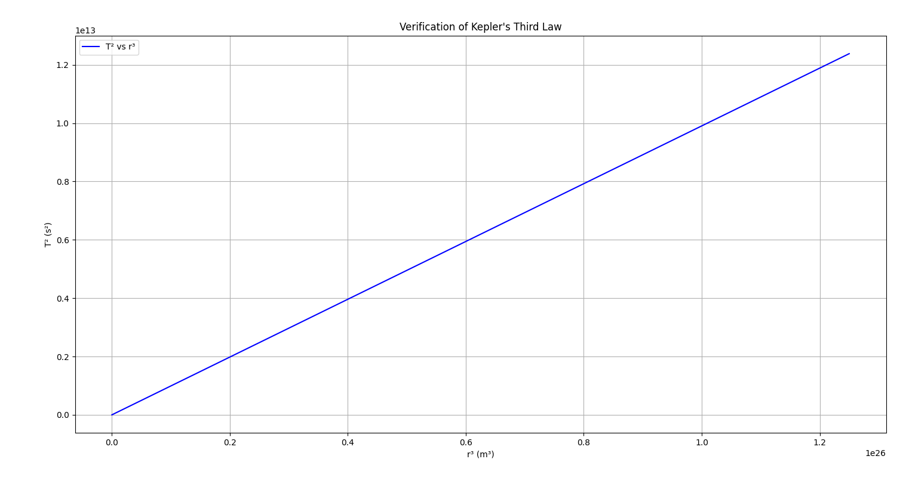

## Problem 1

### Orbital Period and Orbital Radius

---

### 1. Derivation of the Relationship

We start with Newton’s Law of Gravitation and the formula for centripetal force.

**Gravitational Force:**
$$
F_g = \frac{G M m}{r^2}
$$

**Centripetal Force:**
$$
F_c = \frac{m v^2}{r}
$$


Equating the two forces for a body in circular orbit:

\[
\frac{G M m}{r^2} = \frac{m v^2}{r}
\]

Canceling \( m \) and solving for \( v \):

\[
v^2 = \frac{G M}{r}
\]

The orbital period \( T \) is related to the velocity and orbital radius by:

\[
v = \frac{2\pi r}{T}
\]

Substitute into the velocity equation:

\[
\left( \frac{2\pi r}{T} \right)^2 = \frac{G M}{r}
\]

\[
\frac{4\pi^2 r^2}{T^2} = \frac{G M}{r}
\]

Solving for \( T^2 \):

\[
T^2 = \frac{4\pi^2}{G M} r^3
\]

✅ **This shows** that \( T^2 \propto r^3 \), which is **Kepler’s Third Law** for circular orbits.

---

### 2. Python Implementation for Simulations

Below is a Python script to simulate the relationship between orbital period and radius for circular orbits:

<details>
<summary>Click to expand Python code</summary>

```python
# filepath: /simulations/keplers_law_simulation.py
import numpy as np
import matplotlib.pyplot as plt

# Constants
G = 6.67430e-11  # Gravitational constant (m^3 kg^-1 s^-2)
M = 5.972e24     # Mass of Earth (kg)

# Orbital radii (in meters)
radii = np.linspace(1e7, 5e8, 100)
# Periods from Kepler's Third Law
periods = 2 * np.pi * np.sqrt(radii**3 / (G * M))

# Plot T^2 vs r^3
plt.figure(figsize=(8, 5))
plt.plot(radii**3, periods**2, label='T² vs r³', color='blue')
plt.xlabel('r³ (m³)')
plt.ylabel('T² (s²)')
plt.title("Verification of Kepler's Third Law")
plt.grid(True)
plt.legend()
plt.tight_layout()

# Save the figure as a PNG image
plt.savefig("keplers_law_plot.png", dpi=300)

# Optionally display it
plt.show()
```
</details>

---

### 3. Implications for Astronomy

- This relationship allows astronomers to:
  - Determine the **mass of a central body** (e.g., a star or planet) by observing the motion of orbiting objects.
  - Calculate **orbital distances** when the period is known.
  - Model the structure and scale of planetary systems.
- It supports the understanding of **exoplanetary systems** by enabling inference of planetary positions and masses from light curves and Doppler shifts.
- It's essential in **satellite design** and **space mission planning**, ensuring correct orbital parameters for stable orbits.

---

### 4. Real-World Examples

#### Example 1: Moon’s Orbit Around Earth

- Mean radius \( r = 3.84 \times 10^8 \, \text{m} \)
- Orbital period \( T = 27.3 \, \text{days} = 2.36 \times 10^6 \, \text{s} \)

Calculate \( \frac{T^2}{r^3} \):

\[
\frac{(2.36 \times 10^6)^2}{(3.84 \times 10^8)^3} \approx 4.95 \times 10^{-14} \, \text{s}^2/\text{m}^3
\]

#### Example 2: Earth's Orbit Around the Sun

- Radius \( r = 1.496 \times 10^{11} \, \text{m} \)
- Period \( T = 365.25 \, \text{days} = 3.156 \times 10^7 \, \text{s} \)

\[
\frac{(3.156 \times 10^7)^2}{(1.496 \times 10^{11})^3} \approx 2.97 \times 10^{-19} \, \text{s}^2/\text{m}^3
\]

These values align with Kepler’s Law and confirm its consistency across vastly different systems.

---

### 5. Computational Model Output

📷 **Kepler's Third Law: Simulation Plot**



✅ This simulation confirms a linear relationship between \( T^2 \) and \( r^3 \), visually validating Kepler’s Third Law.

---
