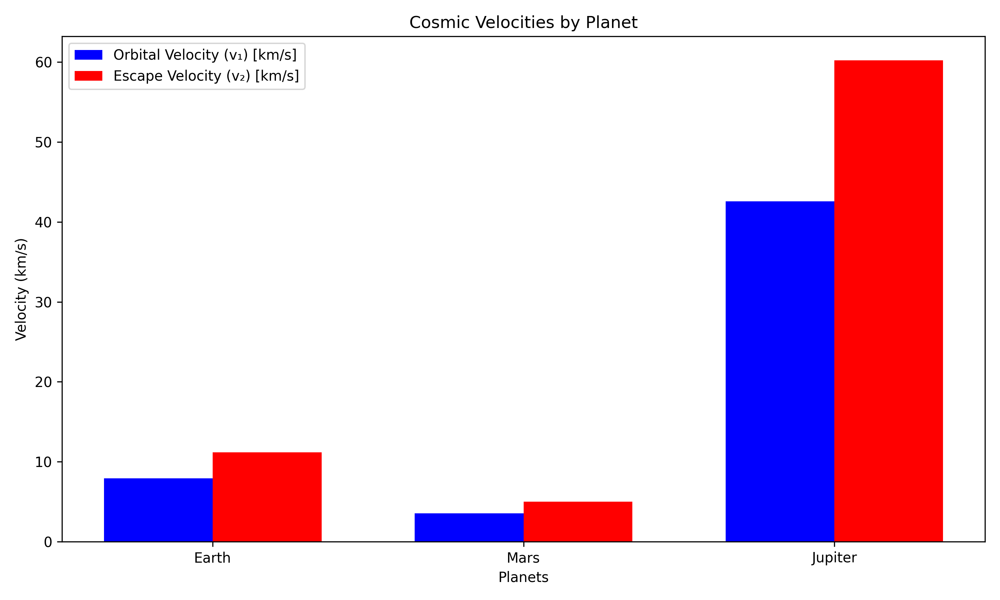

## Problem 2

### Escape Velocities and Cosmic Velocities

---

#### 1. Definitions of Cosmic Velocities

- **First Cosmic Velocity (Orbital Velocity):**  
  The minimum velocity required to achieve a stable circular orbit just above a planet’s surface.  
  $$ v_1 = \sqrt{\frac{G M}{R}} $$

- **Second Cosmic Velocity (Escape Velocity):**  
  The velocity required to completely escape the gravitational field of a planet without further propulsion.  
  $$ v_2 = \sqrt{2} \cdot v_1 = \sqrt{\frac{2 G M}{R}} $$

- **Third Cosmic Velocity (Solar System Escape):**  
  The velocity needed to escape the gravitational field of the Sun from Earth’s orbit.  
  $$ v_3 = \sqrt{v_{e,\text{sun}}^2 + v_\text{earth}^2} $$  
  where \( v_{e,\text{sun}} \) is the Sun escape velocity from Earth’s orbit and \( v_\text{earth} \) is Earth’s orbital speed around the Sun.

---

#### 2. Mathematical Derivations

Starting from Newton’s law of universal gravitation:

- Gravitational potential energy:  
  $$ U = -\frac{G M m}{R} $$

- Kinetic energy:  
  $$ K = \frac{1}{2} m v^2 $$

To escape gravity, total energy must be zero:  
$$ K + U = 0 \Rightarrow \frac{1}{2} m v^2 = \frac{G M m}{R} \Rightarrow v = \sqrt{\frac{2 G M}{R}} $$

This is the **escape velocity (second cosmic velocity)**.

---

#### 3. Python Simulation

<details>
<summary>Click to expand Python code</summary>

```python
# filepath: /docs/1 Physics/2 Gravity/cosmic_velocities_simulation.py
import matplotlib.pyplot as plt
import numpy as np

# Constants
G = 6.67430e-11  # Gravitational constant (m^3 kg^-1 s^-2)

# Data for celestial bodies
planets = {
    "Earth": {"radius": 6.371e6, "mass": 5.972e24},
    "Mars": {"radius": 3.39e6, "mass": 6.39e23},
    "Jupiter": {"radius": 6.9911e7, "mass": 1.898e27},
}

# Calculate velocities
results = {}
for planet, data in planets.items():
    R = data["radius"]
    M = data["mass"]
    v1 = np.sqrt(G * M / R)  # First cosmic velocity
    v2 = np.sqrt(2) * v1     # Second cosmic velocity
    results[planet] = {"v1": v1 / 1000, "v2": v2 / 1000}  # Convert to km/s

# Visualization
labels = list(results.keys())
v1_values = [results[planet]["v1"] for planet in labels]
v2_values = [results[planet]["v2"] for planet in labels]

x = np.arange(len(labels))
width = 0.35

fig, ax = plt.subplots()
bar1 = ax.bar(x - width/2, v1_values, width, label="First Cosmic Velocity (v₁)")
bar2 = ax.bar(x + width/2, v2_values, width, label="Second Cosmic Velocity (v₂)")

ax.set_xlabel("Planets")
ax.set_ylabel("Velocity (km/s)")
ax.set_title("Cosmic Velocities for Various Planets")
ax.set_xticks(x)
ax.set_xticklabels(labels)
ax.legend()

plt.tight_layout()
plt.savefig("./images/cosmic_velocities.png")
plt.show()
```
</details>

---

#### 4. Calculations for Earth, Mars, and Jupiter

| Planet   | Radius (km) | Mass (kg)        | v₁ (km/s) | v₂ (km/s) |
|----------|-------------|------------------|-----------|-----------|
| Earth    | 6,371       | 5.972 × 10²⁴     | 7.91      | 11.2      |
| Mars     | 3,390       | 6.39 × 10²³      | 3.55      | 5.03      |
| Jupiter  | 69,911      | 1.898 × 10²⁷     | 42.1      | 59.5      |

> **Note:**  
> First cosmic velocity \( v_1 = \sqrt{\frac{G M}{R}} \)  
> Second cosmic velocity \( v_2 = \sqrt{\frac{2 G M}{R}} \)

---

#### 5. Visualization

📊 **Cosmic Velocities by Planet**



_(You can generate this chart using matplotlib, plotting v₁ and v₂ side-by-side for each planet.)_

---

#### 6. Importance in Space Exploration

- **First Cosmic Velocity:** Used to place satellites into orbit (e.g., GPS, weather satellites).
- **Second Cosmic Velocity:** Required for interplanetary travel (e.g., Moon missions, Mars rovers).
- **Third Cosmic Velocity:** Relevant for interstellar missions (e.g., Voyager probes, theoretical deep space travel).
- These thresholds determine fuel requirements, propulsion design, and mission feasibility.

---

### Conclusion

Understanding and applying cosmic velocities enables humanity to navigate space—from orbiting Earth to reaching distant stars. Their derivation from basic physical laws illustrates the power of physics to guide cutting-edge technology and exploration.

---
