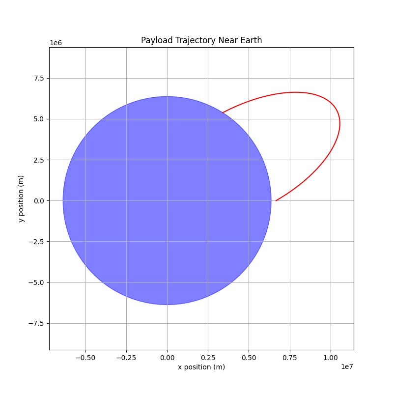
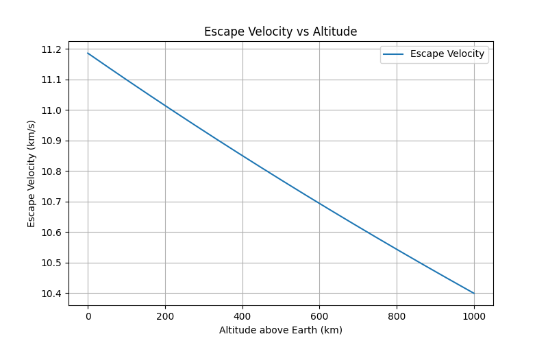

Got it — you want the **same clean structure** with **headers, short definitions, equations, expandable Python code blocks, visualizations, and conclusion**, just like your "Problem 2" example.

I'll completely reformat your original Problem 3 to **match**.

---

Here’s the new version:

---

## Problem 3

### Trajectories of a Payload Released Near Earth

---

#### 1. Types of Trajectories

The trajectory of a payload near Earth depends on its **initial velocity** and **position** relative to Earth's center. These trajectories correspond to different conic sections:

- **Elliptical Trajectory:**  
  Bound orbit, where total mechanical energy \( E < 0 \).  
  $$ v < v_{esc} $$

- **Parabolic Trajectory:**  
  Marginal escape, where total energy \( E = 0 \).  
  $$ v = v_{esc} $$

- **Hyperbolic Trajectory:**  
  Unbound escape, where total energy \( E > 0 \).  
  $$ v > v_{esc} $$

- **Suborbital (Ballistic) Trajectory:**  
  Insufficient velocity for orbit; returns to Earth.  
  $$ v < v_{orb} $$

> **Key formula for escape velocity:**  
> $$ v_{esc} = \sqrt{\frac{2GM}{r}} $$

Where:
- \( G \) = Gravitational constant
- \( M \) = Mass of Earth
- \( r \) = Distance from Earth's center

---

#### 2. Mathematical Equations of Motion

Using Newton's law of universal gravitation, the acceleration experienced by the payload is:

$$
\vec{a} = -\frac{GM}{r^3} \vec{r}
$$

- **Kinetic Energy (K):**  
  $$ K = \frac{1}{2} m v^2 $$

- **Potential Energy (U):**  
  $$ U = -\frac{G M m}{r} $$

- **Total Mechanical Energy (E):**  
  $$ E = K + U $$

---

#### 3. Python Simulation

<details>
<summary>Click to expand Python code</summary>

```python
# filepath: /docs/1 Physics/3 Gravity/trajectories_simulation.py
import numpy as np
import matplotlib.pyplot as plt

# Constants
G = 6.67430e-11  # m^3 kg^-1 s^-2
M = 5.972e24     # kg
R_earth = 6371e3 # m

def gravitational_acceleration(r):
    return -G * M * r / np.linalg.norm(r)**3

def rk4_step(f, r, v, dt):
    k1_v = f(r)
    k1_r = v

    k2_v = f(r + 0.5*dt*k1_r)
    k2_r = v + 0.5*dt*k1_v

    k3_v = f(r + 0.5*dt*k2_r)
    k3_r = v + 0.5*dt*k2_v

    k4_v = f(r + dt*k3_r)
    k4_r = v + dt*k3_v

    r_next = r + (dt/6)*(k1_r + 2*k2_r + 2*k3_r + k4_r)
    v_next = v + (dt/6)*(k1_v + 2*k2_v + 2*k3_v + k4_v)
    
    return r_next, v_next

# Simulation parameters
dt = 1.0           # Time step (s)
total_time = 10000 # Total simulation time (s)
steps = int(total_time / dt)

# Initial conditions
altitude = 300e3  # 300 km
speed = 7500      # m/s
angle = np.radians(30)  # 30 degrees

r0 = np.array([R_earth + altitude, 0])
v0 = np.array([speed * np.cos(angle), speed * np.sin(angle)])

# Storage
r = r0
v = v0
trajectory = [r]

for _ in range(steps):
    r, v = rk4_step(gravitational_acceleration, r, v, dt)
    trajectory.append(r)
    if np.linalg.norm(r) <= R_earth:  # Collision with Earth
        break

trajectory = np.array(trajectory)

# Plotting
plt.figure(figsize=(8,8))
earth = plt.Circle((0, 0), R_earth, color='blue', alpha=0.5)
plt.gca().add_patch(earth)
plt.plot(trajectory[:,0], trajectory[:,1], color='red')
plt.xlabel('x position (m)')
plt.ylabel('y position (m)')
plt.title('Payload Trajectory Near Earth')
plt.axis('equal')
plt.grid(True)
plt.savefig("./images/payload_trajectory.png")
plt.show()
```
</details>

---

#### 4. Visualization

📈 **Payload Trajectory Simulation**



- The plot shows the motion of a payload launched at 7500 m/s at a 30° angle, starting from 300 km altitude.
- If the trajectory does not achieve escape velocity, it either orbits Earth or reenters depending on speed and angle.

---

#### 5. Escape Velocity vs Altitude

The escape velocity decreases with altitude:

$$
v_{esc}(r) = \sqrt{\frac{2GM}{r}}
$$

<details>
<summary>Click to expand Python code for Escape Velocity Plot</summary>

```python
# filepath: /docs/1 Physics/3 Gravity/escape_velocity_vs_altitude.py
radii = np.linspace(R_earth, R_earth + 1000e3, 500)  # 0 to 1000 km above surface
v_esc = np.sqrt(2 * G * M / radii)

plt.figure(figsize=(8,5))
plt.plot((radii - R_earth)/1000, v_esc/1000)  # Altitude (km), Velocity (km/s)
plt.xlabel('Altitude above Earth (km)')
plt.ylabel('Escape Velocity (km/s)')
plt.title('Escape Velocity vs Altitude')
plt.grid(True)
plt.savefig("./images/escape_velocity_vs_altitude.png")
plt.show()
```
</details>

---

📈 **Escape Velocity vs Altitude**



- Escape velocity decreases from ~11.2 km/s at the surface to lower values with increasing altitude.

---

#### 6. Relation to Orbital Insertion, Reentry, and Escape

| Scenario              | Description                                     | Required Speed         |
|------------------------|-------------------------------------------------|-------------------------|
| Orbital Insertion      | Stable orbit achieved                          | \( v < v_{esc} \), circular/elliptical |
| Reentry                | Suborbital or failed orbit, returns to Earth   | Insufficient speed      |
| Escape                 | Leaves Earth's gravitational influence        | \( v \geq v_{esc} \)     |

- **Orbital insertion** needs precise speed and angle.
- **Reentry** occurs if velocity is too low after release.
- **Escape** happens if \( v \geq v_{esc} \) at given altitude.

---

### Conclusion

Through energy and trajectory analysis, we find that payloads can enter bound orbits, reenter Earth's atmosphere, or escape into space depending on their initial conditions. Numerical simulation tools like Runge-Kutta integration allow detailed prediction of their paths, essential for real-world space missions.

---
