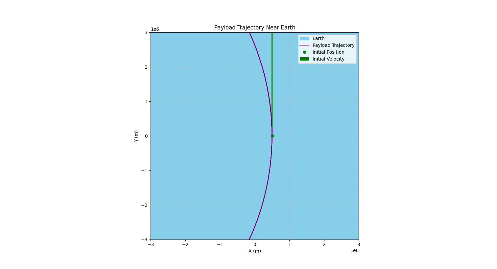

## Problem 3

### Trajectories of a Freely Released Payload Near Earth

---

## Task 1: Analyze the Possible Trajectories of a Payload Released Near Earth

When a payload is released from a rocket near Earth, its trajectory depends primarily on its **initial velocity vector** and **position relative to Earth’s center**. These trajectories can be classified according to the **total mechanical energy (E)** of the system and the **shape of the resulting path**, which corresponds to a conic section.

### 1. Elliptical Trajectory
- **Condition**: Total energy \( E < 0 \)
- **Speed**: Less than escape velocity \( v < v_{esc} \)
- **Shape**: Ellipse
- **Nature**: Bound orbit
- **Examples**:
  - Satellites in low Earth orbit (LEO), medium Earth orbit (MEO), or geostationary orbit (GEO)
- **Equation**:
  \[
  \text{Semi-major axis: } a = -\frac{GM}{2E/m}
  \]

### 2. Parabolic Trajectory
- **Condition**: Total energy \( E = 0 \)
- **Speed**: Exactly escape velocity \( v = v_{esc} \)
- **Shape**: Parabola
- **Nature**: Marginal escape
- **Examples**:
  - Hypothetical perfect escape path with no residual velocity at infinity
- **Key Feature**: Separates bound and unbound motion; transitional trajectory.

### 3. Hyperbolic Trajectory
- **Condition**: Total energy \( E > 0 \)
- **Speed**: Greater than escape velocity \( v > v_{esc} \)
- **Shape**: Hyperbola
- **Nature**: Unbound escape
- **Examples**:
  - Interplanetary probes like Voyager or New Horizons
- **Characteristic**: Payload escapes Earth's gravity with residual speed.

### 4. Suborbital (Ballistic) Trajectory *(Non-conic but relevant)*
- **Condition**: Initial velocity too low for orbit
- **Speed**: \( v < v_{orb} \)
- **Shape**: Segment of an ellipse that intersects Earth
- **Nature**: Returns to Earth
- **Examples**:
  - Reentry vehicles, sounding rockets
- **Key Feature**: The payload follows a curved path but lacks sufficient speed to remain in orbit.

---

### Summary Table

| Trajectory Type | Energy \(E\) | Speed Condition         | Nature     | Shape      |
|-----------------|--------------|--------------------------|------------|------------|
| Elliptical      | \(E < 0\)     | \(v < v_{esc}\)           | Bound      | Ellipse    |
| Parabolic       | \(E = 0\)     | \(v = v_{esc}\)           | Marginal   | Parabola   |
| Hyperbolic      | \(E > 0\)     | \(v > v_{esc}\)           | Unbound    | Hyperbola  |
| Suborbital      | \(E < 0\)     | \(v < v_{orb}\)           | Bound      | Arc/ellipse|

---

### Visualizing Trajectories Near Earth

---

## Task 2: Perform a Numerical Analysis to Compute the Path of the Payload

To compute the path of a payload released near Earth, we can numerically integrate the equations of motion under Earth's gravity using the **Runge-Kutta 4th order (RK4)** method. The motion is governed by Newton's law of gravitation, and we will simulate the trajectory considering initial conditions like **position**, **velocity**, and **altitude**.

### Visualizing the Payload Path

---

## Task 3: Discuss How These Trajectories Relate to Orbital Insertion, Reentry, or Escape Scenarios

#### 1. **Elliptical Trajectory**:  
- **Relation to Orbital Insertion**:  
  An elliptical trajectory is the most common path for objects that are successfully inserted into an orbit around Earth. This is typically the result of a spacecraft being launched with the correct velocity to reach a **bound orbit**, which means it will continue to orbit Earth instead of escaping into space or falling back to Earth. The path is elliptical, with Earth at one of the foci, and the object will move between a perigee (closest point) and an apogee (farthest point).  
  - **Example**: Satellites in Low Earth Orbit (LEO) or Geostationary Orbit (GEO).

- **Key Consideration**: For orbital insertion, the velocity must be sufficient to overcome Earth's gravity but not so high as to escape it. If the payload's speed is too low, it will fall back to Earth, whereas if it's too high, it will follow an escape trajectory (hyperbolic).

#### 2. **Parabolic Trajectory**:  
- **Relation to Escape and Orbital Insertion**:  
  A parabolic trajectory represents the **escape velocity threshold**—the precise speed needed to break free from Earth's gravity without any residual velocity at infinity. A payload that follows a parabolic trajectory is on a **marginal escape path**, where the total mechanical energy of the system is exactly zero. It does not stay in orbit, nor does it escape with excess velocity.  
  - **Example**: A spacecraft launched with exactly the escape velocity (which depends on the altitude and gravitational influence).

- **Key Consideration**: Parabolic trajectories are **transitional**. They are relevant in cases where the objective is to escape Earth's gravitational influence but **not gain any excess energy** that would cause the payload to overshoot or move into another planetary system.

#### 3. **Hyperbolic Trajectory**:  
- **Relation to Escape and Interplanetary Missions**:  
  A hyperbolic trajectory indicates that the object's velocity is **greater than the escape velocity** at the point of release, which means it is on a **hyperbolic escape path**. In this scenario, the payload is no longer bound to Earth and will escape Earth's gravitational influence. The trajectory will continue outward in a hyperbolic curve.  
  - **Example**: Interplanetary probes, such as the Voyager missions or the New Horizons mission, which were launched on hyperbolic escape trajectories toward other planets and beyond.

- **Key Consideration**: Hyperbolic trajectories are crucial for missions aimed at traveling **beyond Earth**, such as **deep space exploration**. These trajectories represent unbound motion, with the payload leaving Earth's sphere of influence, often on a path toward another celestial body.

#### 4. **Suborbital (Ballistic) Trajectory**:  
- **Relation to Reentry and Atmospheric Entry**:  
  Suborbital trajectories occur when a payload is launched **without enough velocity to enter orbit**, and the object follows a curved, parabolic-like path back to Earth. These trajectories are typically associated with **spacecraft reentry**, **sounding rockets**, or **space tourism**.  
  - **Example**: A spacecraft launched on a **ballistic trajectory** that reaches space but does not have enough speed to remain in orbit. It will eventually return to Earth, experiencing atmospheric reentry.
  
- **Key Consideration**: Suborbital trajectories are key to **reentry** missions, where spacecraft, like space capsules or crewed vehicles, must follow a controlled descent path back to Earth. Managing the trajectory during reentry is critical to ensuring that the spacecraft slows down enough to prevent excessive heating during atmospheric entry, allowing for a safe landing.

---

### Summary of Key Relationships:

| **Trajectory Type**  | **Key Scenario**                                | **Nature**                     |
|----------------------|-------------------------------------------------|--------------------------------|
| **Elliptical**        | **Orbital Insertion**                          | Bound motion around Earth      |
| **Parabolic**         | **Escape (Marginal)**                          | Just at escape velocity        |
| **Hyperbolic**        | **Escape (Interplanetary Missions)**           | Unbound, beyond Earth's influence |
| **Suborbital**        | **Reentry or Space Tourism**                   | Curved path returning to Earth |

In space missions, understanding these trajectories is crucial for determining mission parameters, from launching satellites into orbit to planning interplanetary missions or reentering Earth’s atmosphere.

---

## Task 4: Develop a Computational Tool to Simulate and Visualize the Motion of the Payload

The computational tool for simulating and visualizing the motion of the payload under Earth's gravity is implemented using numerical integration methods, such as the **Runge-Kutta 4th order (RK4)** method, to solve the equations of motion. The tool takes into account initial conditions like **initial velocity**, **initial position**, and **altitude**.

### Visualizing the Payload Path

---
