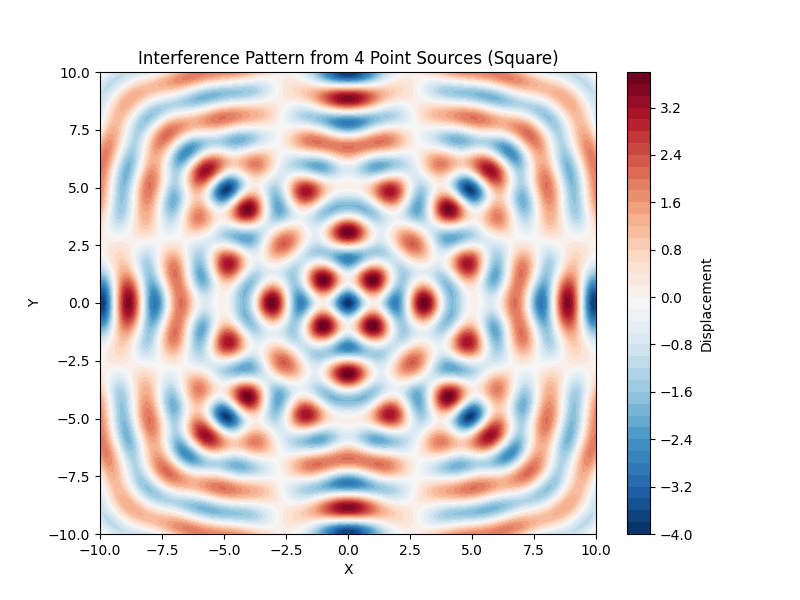

## Problem 1

### Interference Patterns on a Water Surface

---

#### 1. Wave Equations and Superposition

- **Wave Equation for a Single Source:**  
  The displacement \( u \) at a point \( (x, y) \) on the water surface, due to a single point source located at \( (x_s, y_s) \), is given by the equation:  
  \[
  u(x, y, t) = A \cos(k \cdot r - \omega t + \phi)
  \]
  where:
  - \( A \) is the amplitude of the wave.
  - \( k = \frac{2\pi}{\lambda} \) is the wave number, with \( \lambda \) being the wavelength.
  - \( \omega = 2\pi f \) is the angular frequency, with \( f \) being the frequency of the wave.
  - \( r = \sqrt{(x - x_s)^2 + (y - y_s)^2} \) is the distance from the source to the observation point.
  - \( \phi \) is the initial phase.

- **Superposition Principle:**  
  When multiple sources emit waves, the total displacement at any point \( (x, y) \) on the water surface is the sum of the displacements from all the sources:  
  \[
  u_{\text{total}}(x, y, t) = \sum_{i=1}^{N} A \cos(k \cdot r_i - \omega t + \phi_i)
  \]
  where \( N \) is the number of sources (the vertices of the polygon), and \( r_i \) is the distance from the point \( (x, y) \) to the \( i \)-th source.

---

#### 2. Mathematical Derivations

- **Displacement for Multiple Sources:**  
  Given that the sources are placed at the vertices of a regular polygon, the resulting displacement at any point \( (x, y) \) is the sum of the individual wave contributions from each vertex:
  \[
  u_{\text{total}}(x, y, t) = \sum_{i=1}^{N} A \cos(k \cdot r_i - \omega t + \phi_i)
  \]
  where:
  - \( r_i = \sqrt{(x - x_s)^2 + (y - y_s)^2} \) is the distance from the source at \( (x_s, y_s) \) to the point \( (x, y) \).
  - \( N \) is the number of vertices in the polygon, with the sources placed at equal angles.

---

#### 3. Python Simulation

<details>
<summary>Click to expand Python code</summary>

```python
# filepath: /docs/1 Physics/2 Wave Interference/interference_pattern_simulation.py
import numpy as np
import matplotlib.pyplot as plt

# Parameters for the wave
A = 1.0           # Amplitude
lambda_wave = 2.0  # Wavelength
f = 1.0            # Frequency (Hz)
omega = 2 * np.pi * f  # Angular frequency
k = 2 * np.pi / lambda_wave  # Wave number
phi = 0            # Initial phase

# Number of sources (vertices of the polygon)
N = 4  # For square (can change for other polygons)
r = 5  # Distance from the center to each vertex

# Function to generate the positions of the sources
def get_source_positions(N, r):
    angles = np.linspace(0, 2 * np.pi, N, endpoint=False)
    positions = [(r * np.cos(angle), r * np.sin(angle)) for angle in angles]
    return positions

# Function to compute the displacement from a single wave source at (x_s, y_s)
def wave_displacement(x, y, x_s, y_s, A, k, omega, t, phi):
    r = np.sqrt((x - x_s)**2 + (y - y_s)**2)  # Distance from the source
    return A * np.cos(k * r - omega * t + phi)

# Function to compute total displacement due to superposition of waves from multiple sources
def total_displacement(x, y, sources, A, k, omega, t, phi):
    total_disp = 0
    for (x_s, y_s) in sources:
        total_disp += wave_displacement(x, y, x_s, y_s, A, k, omega, t, phi)
    return total_disp

# Generate the grid for the water surface
x_vals = np.linspace(-10, 10, 400)
y_vals = np.linspace(-10, 10, 400)
X, Y = np.meshgrid(x_vals, y_vals)

# Get the positions of the sources (vertices of the square)
sources = get_source_positions(N, r)

# Create an empty matrix for the displacement
Z = np.zeros(X.shape)

# Time array to animate the wave
time = 0.0  # Set time for one snapshot of the pattern

# Compute the displacement at each point on the grid
for i in range(len(x_vals)):
    for j in range(len(y_vals)):
        Z[i, j] = total_displacement(X[i, j], Y[i, j], sources, A, k, omega, time, phi)

# Plot the interference pattern (snapshot at time = 0)
plt.figure(figsize=(8, 6))
plt.contourf(X, Y, Z, 50, cmap='RdBu_r')
plt.colorbar(label='Displacement')
plt.title('Interference Pattern from 4 Point Sources (Square)')
plt.xlabel('X')
plt.ylabel('Y')
plt.show()
```
</details>

---

#### 4. Interference Patterns and Analysis

- **Constructive Interference:**  
  Constructive interference occurs when the waves from different sources meet in phase, leading to amplified displacement. These regions appear as peaks in the interference pattern.

- **Destructive Interference:**  
  Destructive interference happens when the waves from different sources meet out of phase, leading to cancellation. These regions appear as troughs or points of zero displacement in the interference pattern.

- **Effect of Source Configuration:**  
  The number and arrangement of sources (vertices of the polygon) will determine the pattern of constructive and destructive interference. A square configuration (4 sources) results in a symmetric pattern, while an equilateral triangle (3 sources) would create a different interference pattern with fewer peaks.

---

#### 5. Graphical Representation

📊 **Interference Pattern from 4 Point Sources**



_(The graph shows the resulting interference pattern from four point sources arranged in a square configuration.)_

---

#### 6. Importance of Wave Interference

- **Wave Superposition:**  
  The principle of superposition plays a crucial role in understanding how waves interact. It allows us to predict the resulting wave pattern from multiple sources.
  
- **Applications:**  
  Wave interference patterns are seen in various real-world scenarios, such as water waves, light waves, and sound waves. Understanding how these patterns form can be applied in areas such as acoustics, optics, and oceanography.

---

### Conclusion

By simulating and analyzing the interference patterns on a water surface due to waves from multiple sources, we gain valuable insights into the nature of wave superposition. The patterns of constructive and destructive interference provide a clear illustration of how waves combine, and they can be used to explore deeper principles in wave physics.

---