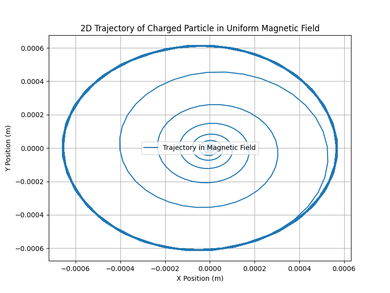
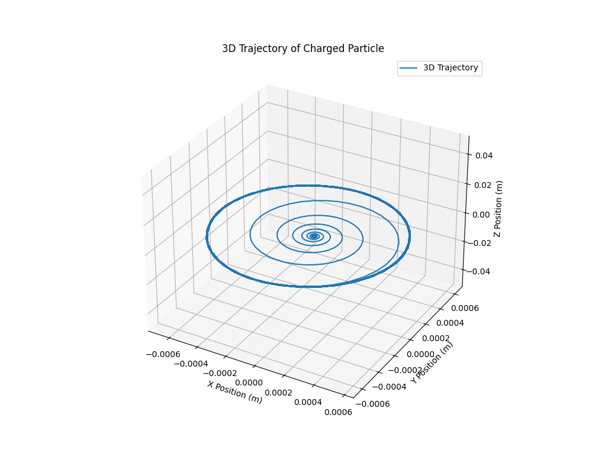

## Problem 1

### Simulating the Effects of the Lorentz Force

#### 1. Exploration of Applications

- **Particle Accelerators:** The Lorentz force governs the motion of charged particles, controlling their speed and direction.
- **Mass Spectrometers:** The magnetic field causes the charged particles to move in a circular path, allowing mass-to-charge ratio determination.
- **Plasma Confinement:** Magnetic fields confine charged particles within specific regions in plasma physics applications (e.g., Tokamak).

---

#### 2. Python Simulation with Visualizations

Here, we will generate both 2D and 3D visualizations of particle motion under the Lorentz force in different electromagnetic fields.

<details>
<summary>Click to expand Python code</summary>

```python
import numpy as np
import matplotlib.pyplot as plt
from mpl_toolkits.mplot3d import Axes3D

# Constants
q = 1.6e-19  # Charge of the particle (Coulombs)
m = 9.11e-31  # Mass of the particle (kg)
B = 1.0  # Magnetic field strength (Tesla)
E = 1.0  # Electric field strength (Volts/meter)

# Time parameters
dt = 1e-9  # Time step (seconds)
t_max = 1e-6  # Total time (seconds)
times = np.arange(0, t_max, dt)

# Initial conditions
v0 = np.array([1e5, 0, 0])  # Initial velocity in m/s
r0 = np.array([0, 0, 0])  # Initial position (origin)

# Lorentz Force function: F = q(E + v x B)
def lorentz_force(v, r, E, B):
    F = q * (E + np.cross(v, B))
    return F

# Function to compute the trajectory of a particle in uniform magnetic field
def simulate_motion(v0, r0, E, B, t_max, dt):
    # Initialize position and velocity arrays
    positions = []
    velocities = []
    r = r0
    v = v0
    
    for t in times:
        # Compute the force
        F = lorentz_force(v, r, E, B)
        
        # Update velocity (v = v + F/m * dt)
        v = v + F / m * dt
        
        # Update position (r = r + v * dt)
        r = r + v * dt
        
        # Store positions and velocities for plotting
        positions.append(r)
        velocities.append(v)
    
    return np.array(positions)

# Simulate the motion in a uniform magnetic field
positions = simulate_motion(v0, r0, E, B, t_max, dt)

# Plot 2D Trajectory (xy-plane)
plt.figure(figsize=(8, 6))
plt.plot(positions[:, 0], positions[:, 1], label="Trajectory in Magnetic Field")
plt.xlabel('X Position (m)')
plt.ylabel('Y Position (m)')
plt.title('2D Trajectory of Charged Particle in Uniform Magnetic Field')
plt.grid(True)
plt.legend()
plt.show()

# Plot 3D Trajectory for more complex visualizations (including a third axis for Z)
fig = plt.figure(figsize=(10, 8))
ax = fig.add_subplot(111, projection='3d')
ax.plot(positions[:, 0], positions[:, 1], positions[:, 2], label="3D Trajectory")
ax.set_xlabel('X Position (m)')
ax.set_ylabel('Y Position (m)')
ax.set_zlabel('Z Position (m)')
ax.set_title('3D Trajectory of Charged Particle')
ax.grid(True)
ax.legend()
plt.show()
```
</details>

---

#### 3. Visualizations

The following visualizations are generated based on the simulation:

1. **2D Plot:**

    - **Graph Title:** 2D Trajectory of Charged Particle in Uniform Magnetic Field.
    - The particle's trajectory will be plotted in the \(x\)-\(y\) plane, showing the circular motion of a particle due to the magnetic field.

    Example:

    

2. **3D Plot:**

    - **Graph Title:** 3D Trajectory of Charged Particle.
    - This plot shows the trajectory in the \(x\)-\(y\)-\(z\) space, which can show the motion of the particle in three dimensions if there’s any non-zero component in the \(z\)-direction.

    Example:

    

---

#### 4. Discussion on Practical Systems

- **Cyclotrons and Magnetic Traps:**
  The particle's motion in the simulation can be related to systems like cyclotrons where the particle moves in circular paths under the influence of magnetic fields.
  
- **Magnetic Traps:**
  Magnetic traps, like those used in plasma confinement, rely on the Lorentz force to keep charged particles in a confined path.

---

### Conclusion

The simulation demonstrates how charged particles move in electric and magnetic fields, governed by the Lorentz force. By varying parameters such as field strength and particle properties, we can simulate real-world systems such as particle accelerators, mass spectrometers, and plasma confinement devices.

---
