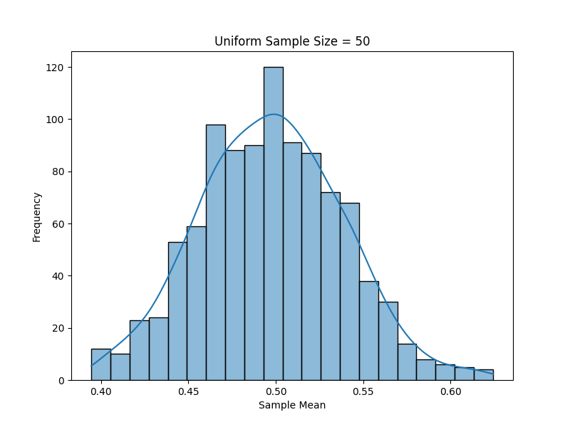
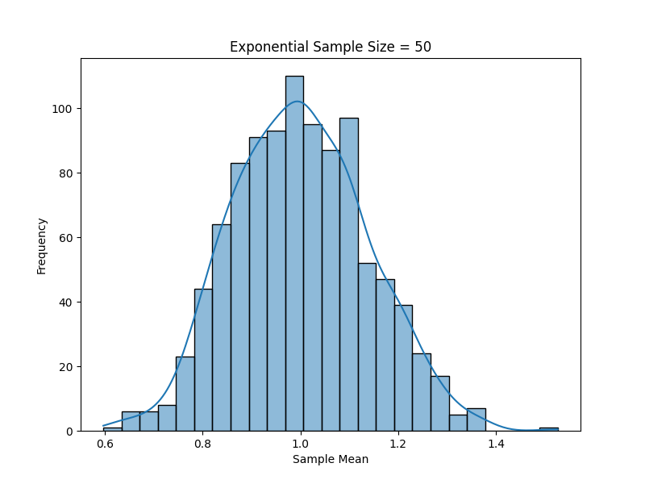
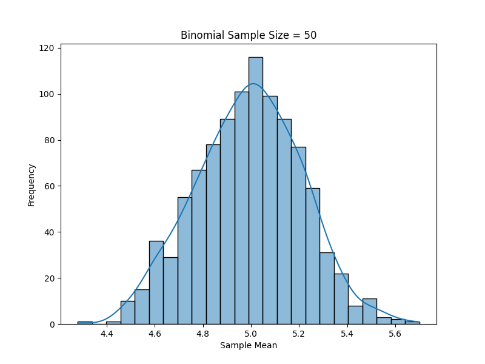

## Problem 1

### Exploring the Central Limit Theorem through Simulations

#### 1. Motivation and Exploration of Applications

The **Central Limit Theorem (CLT)** is one of the most important principles in probability and statistics. It states that the sampling distribution of the sample mean will approach a normal distribution as the sample size increases, regardless of the original distribution of the population. 

**Applications of CLT:**

- **Estimating Population Parameters**: CLT allows us to estimate the population mean by sampling from the population, even if we don't know the population's distribution.
- **Quality Control in Manufacturing**: The CLT is used to monitor the quality of products by sampling from a production line and making inferences about the entire batch.
- **Financial Models**: In finance, the CLT is used to estimate average returns and risk across large portfolios.
- **Medical Research**: CLT is applied in clinical trials and other research where population data is unavailable but sample data is abundant.

---

#### 2. Python Simulation with Visualizations

In this simulation, we will generate different types of population distributions (Uniform, Exponential, and Binomial), sample from these populations, and observe how the sample mean distribution converges to a normal distribution as the sample size increases. We will also explore how the population variance and sample size impact this convergence.

<details>
<summary>Click to expand Python code</summary>

```python
import numpy as np
import matplotlib.pyplot as plt
import seaborn as sns

# Parameters for the simulation
population_size = 1000000  # Large population size for each distribution

# Uniform distribution
uniform_population = np.random.uniform(0, 1, population_size)

# Exponential distribution
exponential_population = np.random.exponential(1, population_size)

# Binomial distribution
binomial_population = np.random.binomial(10, 0.5, population_size)

# Function to generate sample means for various sample sizes
def sample_means(population, sample_sizes, n_samples=10000):
    means_dict = {}
    for size in sample_sizes:
        sample_means = []
        for _ in range(n_samples):
            sample = np.random.choice(population, size=size, replace=False)
            sample_means.append(np.mean(sample))
        means_dict[size] = sample_means
    return means_dict

# Sample sizes to explore
sample_sizes = [5, 10, 30, 50]

# Get sample means for each distribution
uniform_sample_means = sample_means(uniform_population, sample_sizes)
exponential_sample_means = sample_means(exponential_population, sample_sizes)
binomial_sample_means = sample_means(binomial_population, sample_sizes)
```
</details>

---

#### 3. Visualizations

The following visualizations are generated based on the simulation of the sampling distributions:

1. **Uniform Distribution Sampling Means:**
    - **Graph Title:** Uniform Distribution Sample Means for Varying Sample Sizes.
    - The sampling distribution of the sample means approaches normality as the sample size increases.

    Example:

    

2. **Exponential Distribution Sampling Means:**
    - **Graph Title:** Exponential Distribution Sample Means for Varying Sample Sizes.
    - Even though the population is skewed, the sampling distribution of the sample means becomes more normal as the sample size increases.

    Example:

    

3. **Binomial Distribution Sampling Means:**
    - **Graph Title:** Binomial Distribution Sample Means for Varying Sample Sizes.
    - The binomial distribution shows convergence to normality with an increase in sample size.

    Example:

    

---

#### 4. Discussion on Practical Systems

- **Estimating Population Parameters:**
  The CLT allows for estimating the population mean from a sample, which is particularly useful when working with large datasets where the population is not easily accessible.
  
- **Quality Control in Manufacturing:**
  By applying the CLT, manufacturers can use sample data to monitor quality, detect problems in the production process, and ensure consistency.

- **Financial Applications:**
  In finance, the CLT allows analysts to predict average returns and risk in portfolios. It enables the use of normal distributions to estimate probabilities and make decisions based on sample data.

---

### Conclusion

This simulation demonstrates the **Central Limit Theorem** by showing how the sampling distribution of the sample mean converges to a normal distribution as the sample size increases. It highlights the importance of the CLT in various real-world applications, including estimating population parameters, quality control, and financial modeling.

---
