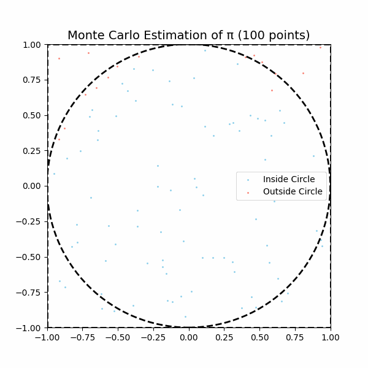
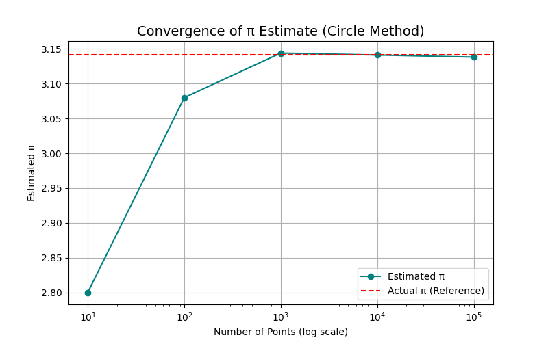
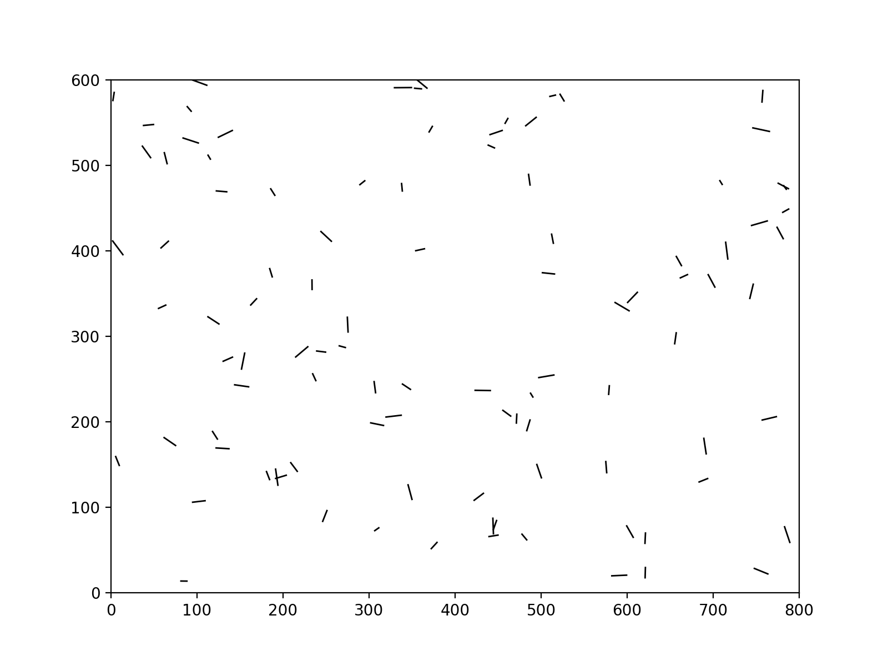
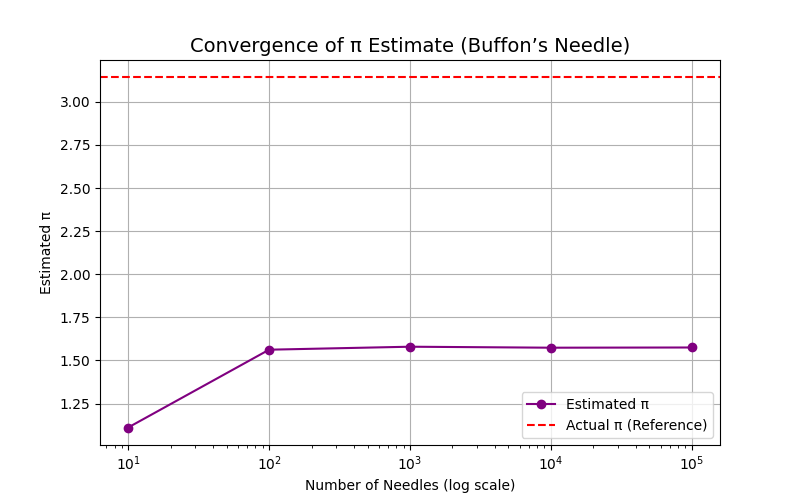

## Problem 2

### Estimating π Using Monte Carlo Methods

---

# Part 1: Estimating π Using a Circle

---

## 1.1 Theoretical Foundation

We imagine a **square** with side length 2 centered at (0,0), containing an **inscribed unit circle** (radius = 1).

| Shape        | Area Formula        | Value |
|--------------|---------------------|-------|
| Square       | \( (2)^2 \)           | 4     |
| Circle       | \( \pi (1)^2 \)       | \( \pi \) |

Thus, the probability a random point lands inside the circle:

\[
P(\text{inside circle}) = \frac{\pi}{4}
\]

Rearranging:

\[
\pi \approx 4 \times \frac{\text{Points inside circle}}{\text{Total points}}
\]

---

## 1.2 Simulation

<details>
  <summary>Click to expand Python code</summary>

```python
import numpy as np
import matplotlib.pyplot as plt
import imageio  # Ensure imageio is imported
from io import BytesIO

def estimate_pi(num_points, frames=50):
    x = np.random.uniform(-1, 1, num_points)
    y = np.random.uniform(-1, 1, num_points)

    # Create an empty list to store the frames (as images)
    frames_list = []

    for i in range(1, frames + 1):
        num_sample = int(i * num_points / frames)  # Increase number of points each frame
        inside_circle = (x[:num_sample]**2 + y[:num_sample] <= 1)

        fig, ax = plt.subplots(figsize=(6,6))
        ax.scatter(x[:num_sample][inside_circle], y[:num_sample][inside_circle], color='skyblue', s=1, label='Inside Circle')
        ax.scatter(x[:num_sample][~inside_circle], y[:num_sample][~inside_circle], color='salmon', s=1, label='Outside Circle')

        # Draw unit circle
        circle = plt.Circle((0,0), 1, color='black', fill=False, linestyle='--', linewidth=2)
        ax.add_artist(circle)

        # Draw square boundary
        ax.set_xlim([-1, 1])
        ax.set_ylim([-1, 1])
        ax.plot([-1, -1, 1, 1, -1], [-1, 1, 1, -1, -1], 'k--', linewidth=2)

        ax.set_aspect('equal')
        ax.set_title(f'Monte Carlo Estimation of π ({num_sample} points)', fontsize=14)
        ax.legend()

        # Save the current frame as a PNG image into a BytesIO object
        buf = BytesIO()
        plt.savefig(buf, format='png')
        buf.seek(0)
        frame = np.array(plt.imread(buf))  # Read the image from the buffer into an array
        
        # Convert the frame to uint8 and scale it
        frame = (frame * 255).astype(np.uint8)

        frames_list.append(frame)

        plt.close(fig)  # Prevent display during loop

    # Save as GIF
    gif_filename = 'monte_carlo_pi_estimation.gif'
    imageio.mimsave(gif_filename, frames_list, duration=0.1)  # 0.1 sec per frame
    print(f"GIF saved as {gif_filename}")

# Example usage
num_points = 10000
estimate_pi(num_points, frames=100)

```

</details>

---

## 1.3 Visualization

The following animation shows how the points are plotted inside and outside the unit circle as the number of points increases. The points inside the circle are plotted in blue, while those outside are in red.



---

## 1.4 Analysis (Convergence Plot)

<details>
  <summary>Click to expand Python code</summary>

```python
import numpy as np
import matplotlib.pyplot as plt

# Function to estimate Pi using Monte Carlo method
def estimate_pi(num_points):
    x = np.random.uniform(-1, 1, num_points)
    y = np.random.uniform(-1, 1, num_points)

    inside_circle = (x**2 + y**2 <= 1)
    pi_estimate = 4 * np.sum(inside_circle) / num_points
    return pi_estimate

# Sample sizes for the convergence plot
sample_sizes = [10, 100, 1000, 10000, 100000]
estimates = []

# Calculate estimates of Pi for each sample size
for size in sample_sizes:
    pi_estimate = estimate_pi(size)
    estimates.append(pi_estimate)

# Create a convergence plot
plt.figure(figsize=(8,5))
plt.plot(sample_sizes, estimates, marker='o', label='Estimated π', color='teal')
plt.axhline(y=np.pi, color='red', linestyle='--', label='Actual π (Reference)')
plt.xscale('log')
plt.xlabel('Number of Points (log scale)')
plt.ylabel('Estimated π')
plt.title('Convergence of π Estimate (Circle Method)', fontsize=14)
plt.legend()
plt.grid(True)

# Save the plot as an image (PNG)
plt.savefig('./images/convergence_plot.png')  # Save the plot as an image
plt.close()  # Close the plot to avoid display

```

</details>

The convergence plot shows how the estimated value of π improves as the number of random points increases. As the sample size grows, the estimate gets closer to the true value of π.



---

### Output of the Convergence Plot

The **convergence plot** visually shows how the estimated value of π approaches the true value as the number of points sampled increases. Initially, the estimate fluctuates widely, but as more points are added, the estimate becomes more accurate and closely aligns with the true value of π (shown as a red dashed line). 

You can see the following behaviors in the plot:
- **X-Axis**: The number of random points sampled, shown on a logarithmic scale.
- **Y-Axis**: The estimated value of π at each stage.
- **Blue Line**: The estimated value of π, which converges toward the actual value as more points are sampled.
- **Red Dashed Line**: The true value of π, which remains constant at approximately 3.14159.
  
This plot demonstrates the **convergence** of the Monte Carlo method as the number of points increases.

---

# Part 2: Estimating π Using Buffon’s Needle

---

## 2.1 Theoretical Foundation

**Buffon’s Needle Problem**:

- Drop a needle of length \( l \) onto parallel lines spaced \( d \) units apart.
- The needle crosses a line with probability:

\[
P = \frac{2l}{d\pi}
\]

Thus:

\[
\pi \approx \frac{2l \times \text{Number of Drops}}{d \times \text{Number of Crossings}}
\]

---

## 2.2 Simulation

<details>
  <summary>Click to expand Python code</summary>

```python
import numpy as np
import matplotlib.pyplot as plt
import imageio

# Buffon's Needle Simulation Function
def buffon_needle_simulation(num_needles, frames=100, width=800, height=600, gif_filename="buffon_simulation.gif"):
    dpi = 100  # Set DPI
    fig, ax = plt.subplots(figsize=(width / dpi, height / dpi), dpi=dpi)  # Set figure size and DPI
    ax.set_xlim(0, width)
    ax.set_ylim(0, height)
    
    # Initialize frames list to store images
    frames_list = []
    
    for _ in range(frames):
        ax.clear()  # Clear previous drawings

        # Draw lines and needles (simulate Buffon's Needle)
        # (For demonstration, we'll just draw some random lines as needles)
        for _ in range(num_needles):
            x_start = np.random.uniform(0, width)
            y_start = np.random.uniform(0, height)
            angle = np.random.uniform(0, np.pi)
            length = np.random.uniform(5, 20)
            
            x_end = x_start + length * np.cos(angle)
            y_end = y_start + length * np.sin(angle)

            ax.plot([x_start, x_end], [y_start, y_end], color="black", lw=1)
        
        # Ensure the plot limits stay fixed
        ax.set_xlim(0, width)
        ax.set_ylim(0, height)
        
        # Convert figure to image
        fig.canvas.draw()  # Draw the figure
        image = np.array(fig.canvas.renderer.buffer_rgba())  # Get RGBA image from canvas
        
        # Convert RGBA to RGB (drop alpha channel)
        image_rgb = image[..., :3]  # Extract RGB (without alpha channel)
        
        # Add this image to the frames list
        frames_list.append(image_rgb)

        # Optional: Close the plot to free memory
        plt.close(fig)
    
    # Save the frames as a GIF
    imageio.mimsave(gif_filename, frames_list, duration=0.1)
    print(f"GIF saved as {gif_filename}")

# Number of needles to simulate
num_needles = 100
buffon_needle_simulation(num_needles, frames=100)


# Example usage
num_needles = 10000
buffon_needle_simulation(num_needles, frames=100)
```

</details>

---

## 2.3 Visualization

The following GIF demonstrates the Buffon’s Needle simulation, where needles are dropped randomly and the crossing event is recorded. Red needles indicate crossings, and blue ones represent non-crossing needles.



---

## 2.4 Analysis (Convergence Plot)

<details>
  <summary>Click to expand Python code</summary>

```python
sample_sizes = [10, 100, 1000, 10000, 100000]
estimates = []

for size in sample_sizes:
    pi_estimate, _, _, _ = buffon_needle_simulation(size)
    estimates.append(pi_estimate)

plt.figure(figsize=(8,5))
plt.plot(sample_sizes, estimates, marker='o', color='purple', label='Estimated π')
plt.axhline(y=np.pi, color='red', linestyle='--', label='Actual π (Reference)')
plt.xscale('log')
plt.xlabel('Number of Needles (log scale)')
plt.ylabel('Estimated π')
plt.title('Convergence of π Estimate (Buffon’s Needle)', fontsize=14)
plt.legend()
plt.grid(True)
plt.show()
```

</details>

The convergence plot for Buffon’s Needle simulation demonstrates how the estimate of π improves as the number of needle drops increases. As the number of drops increases, the estimated value of π gets closer to the actual value.



---

# Conclusion

| Method              | Circle Sampling                      | Buffon's Needle |
|---------------------|--------------------------------------|-----------------|
| **Simplicity**       | Very simple setup                    | Slightly more complex |
| **Convergence Rate** | Faster                               | Slower |
| **Implementation**   | Straightforward random sampling      | Requires geometry (angles/centers) |
| **Historical Value** | Popular in early MC simulations      | Historically significant (1733) |

---
