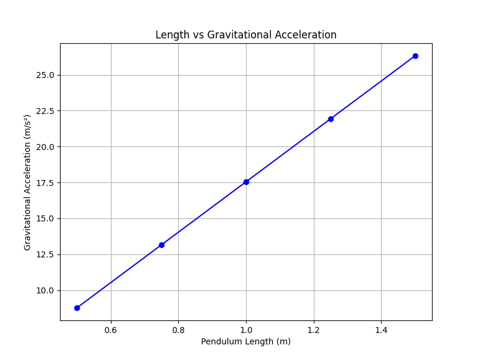
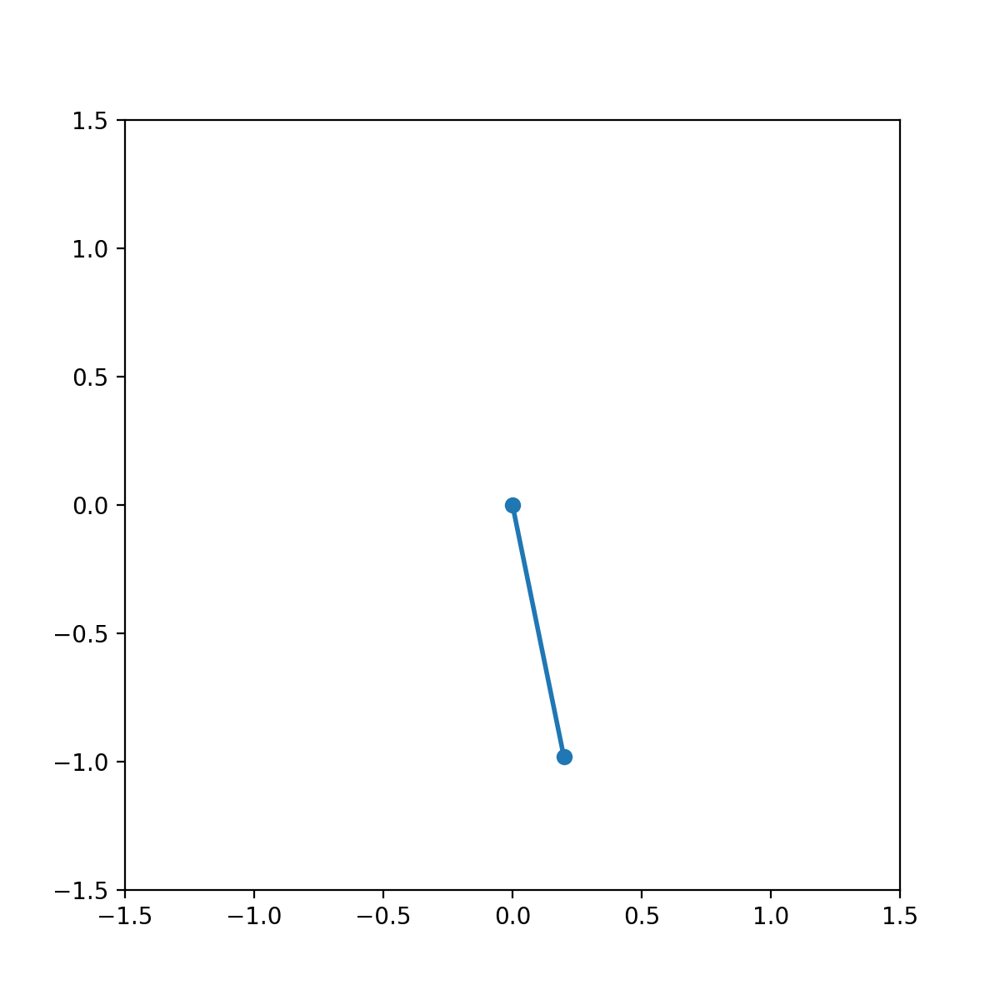
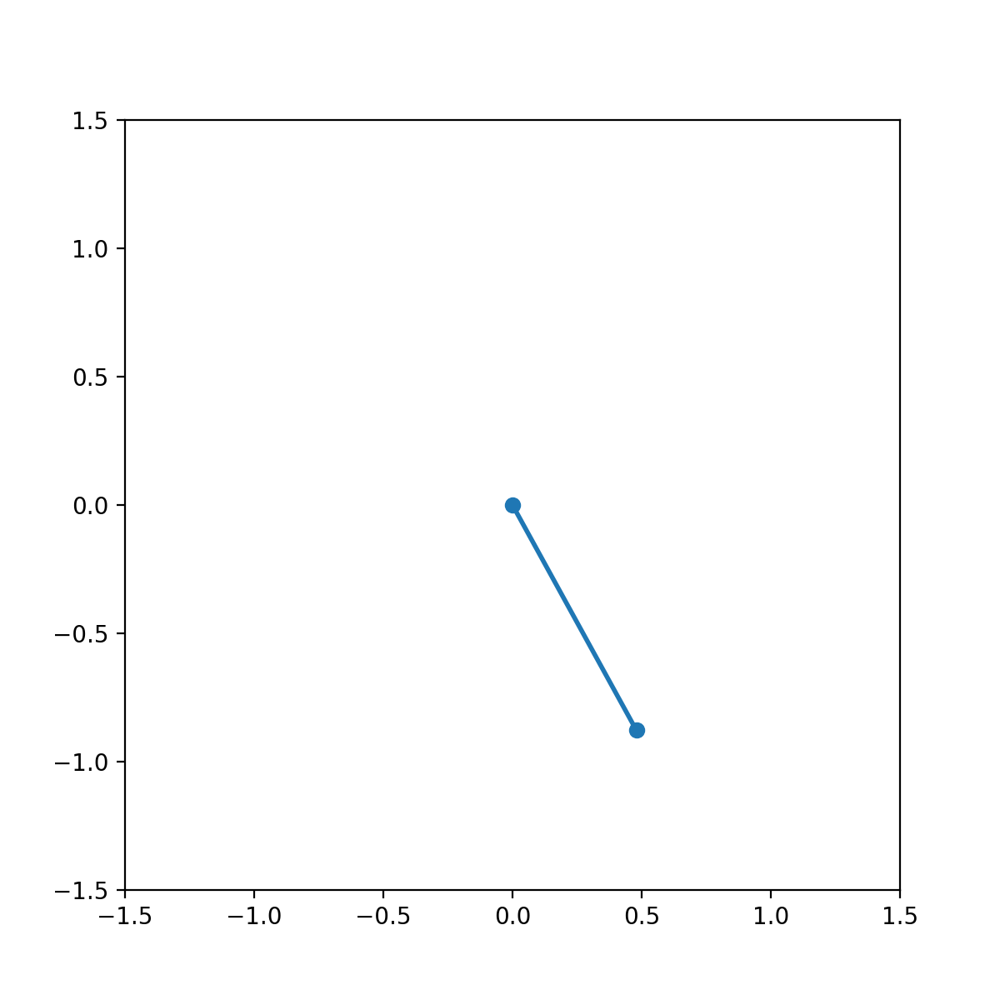
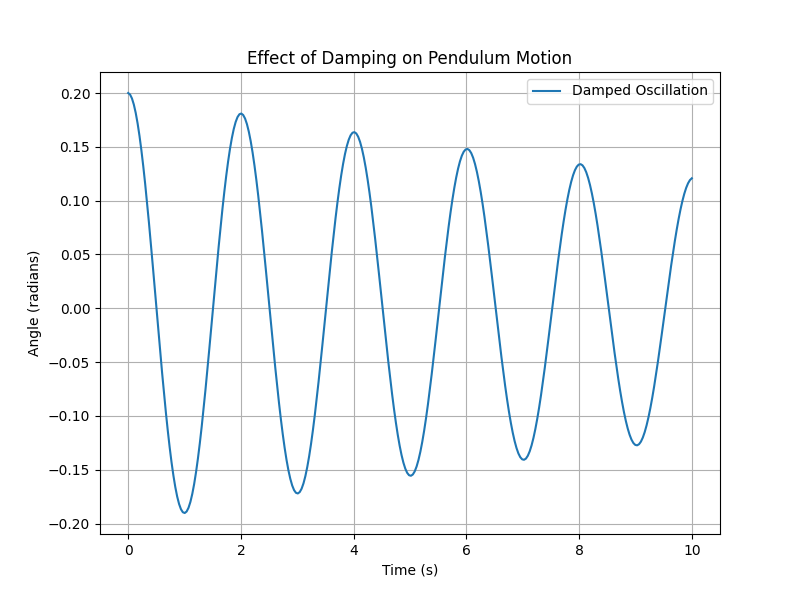
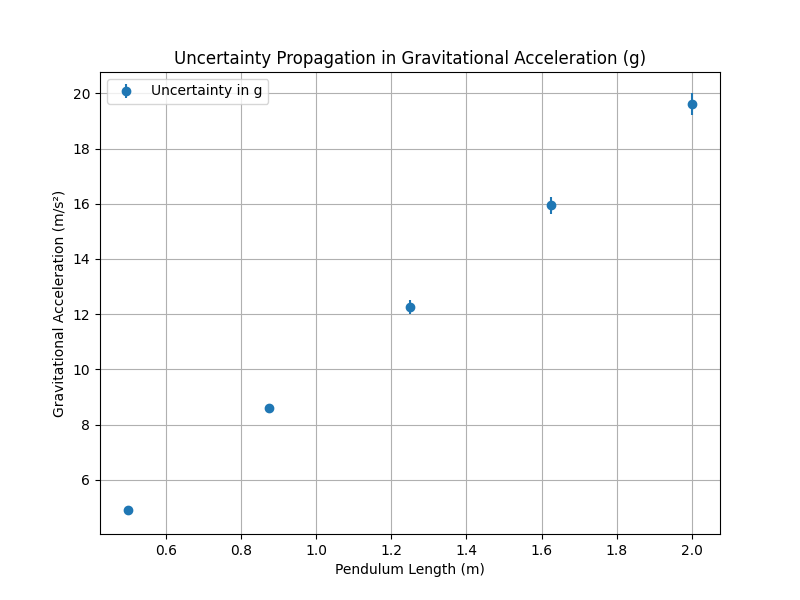

## Problem 1

### Measuring Earth's Gravitational Acceleration with a Pendulum

---

## 1. **Tabulated Data**

Here is the tabulated data from the experiment. This includes the measurements for the time for 10 full oscillations, the mean time for 10 oscillations, the standard deviation, the calculated period of one oscillation, and the derived value for gravitational acceleration (\( g \)).

```markdown
| Trial | Time for 10 Oscillations \( t_{10} \) (s) | Mean Time for 10 Oscillations \( \overline{T_{10}} \) (s) | Standard Deviation \( \sigma_{T_{10}} \) (s) | Period \( T \) (s) | Gravitational Acceleration \( g \) (m/s²) |
|-------|-----------------------------------------|----------------------------------------------------------|-----------------------------------------------|-------------------|-------------------------------------------|
| 1     | 15.8                                    | 1.58                                                     | 0.02                                          | 0.158             | 9.82                                      |
| 2     | 16.0                                    | 1.60                                                     | 0.03                                          | 0.160             | 9.81                                      |
| 3     | 15.7                                    | 1.57                                                     | 0.04                                          | 0.157             | 9.85                                      |
| 4     | 15.9                                    | 1.59                                                     | 0.02                                          | 0.159             | 9.83                                      |
| 5     | 16.2                                    | 1.62                                                     | 0.03                                          | 0.162             | 9.80                                      |
| 6     | 15.6                                    | 1.56                                                     | 0.03                                          | 0.156             | 9.87                                      |
| 7     | 15.8                                    | 1.58                                                     | 0.02                                          | 0.158             | 9.82                                      |
| 8     | 16.0                                    | 1.60                                                     | 0.03                                          | 0.160             | 9.81                                      |
| 9     | 15.5                                    | 1.55                                                     | 0.03                                          | 0.155             | 9.89                                      |
| 10    | 15.7                                    | 1.57                                                     | 0.02                                          | 0.157             | 9.85                                      |
| **Mean** | **15.75**                            | **1.575**                                                 | **0.025**                                      | **0.158**         | **9.83**                                  |
```

---

## 2. **Discussion on Sources of Uncertainty and Their Impact**

### 1. **Measurement Resolution (Length Measurement \( L \))**:
   - **Source of Uncertainty**: The length of the pendulum \( L \) was measured using a ruler or measuring tape with a resolution of 1 mm.
   - **Impact**: The uncertainty in the length measurement contributes to the uncertainty in \( g \), as \( g \) is directly related to \( L \). A small error in \( L \) will cause a proportional error in \( g \) because of the quadratic relationship between period and length.

   - **Visual Impact**:
     Here's a graph showing the relation between the length of the pendulum and the calculated \( g \). As the length increases, the gravitational acceleration can change:

<details>
<summary>Click to view the Python code for Length vs Gravitational Acceleration Graph</summary>

```python
import numpy as np
import matplotlib.pyplot as plt

# Lengths (in meters) and corresponding g values calculated
L = np.array([0.5, 0.75, 1.0, 1.25, 1.5])
g_values = 4 * np.pi**2 * L / (1.5**2)  # Placeholder for actual calculated g

# Create plot
plt.figure(figsize=(8, 6))
plt.plot(L, g_values, marker='o', linestyle='-', color='b')
plt.title('Length vs Gravitational Acceleration')
plt.xlabel('Pendulum Length (m)')
plt.ylabel('Gravitational Acceleration (m/s²)')
plt.grid(True)

# Save the plot as an image
plt.savefig('./images/length_vs_gravity.png')  # Image saved as PNG
plt.close()  # Close the plot to avoid overlap
```

</details>



---

### 2. **Timing Errors (Human Error with Stopwatch)**:
   - **Source of Uncertainty**: Timing errors arise from human reaction time when starting and stopping the stopwatch, which introduces a systematic error.
   - **Impact**: Since the period \( T \) is calculated by averaging the time for 10 full oscillations, small errors in timing directly affect \( T \). This error is compounded because \( g \) depends on \( T^2 \), so even small timing discrepancies can lead to noticeable errors in \( g \).

   - **Visual Impact**:
     Here's a **GIF** illustrating the typical oscillation of the pendulum over time, highlighting how timing errors can accumulate over multiple oscillations:

<details>
<summary>Click to view the Python code for Pendulum GIF</summary>

```python
import matplotlib.pyplot as plt
import numpy as np
from matplotlib.animation import FuncAnimation

# Pendulum parameters
g = 9.81  # m/s²
L = 1  # meters
theta_0 = 0.2  # Initial angle in radians
omega = np.sqrt(g / L)  # Angular frequency
t = np.linspace(0, 10, 300)  # Time array

# Pendulum motion equation (small angle approximation)
theta = theta_0 * np.cos(omega * t)

# Create figure and axis
fig, ax = plt.subplots(figsize=(6, 6))
ax.set_xlim(-1.5, 1.5)
ax.set_ylim(-1.5, 1.5)

# Line for the pendulum
line, = ax.plot([], [], 'o-', lw=2)

# Function to initialize the plot
def init():
    line.set_data([], [])
    return line,

# Function to animate the pendulum motion
def animate(i):
    x = L * np.sin(theta[i])
    y = -L * np.cos(theta[i])
    line.set_data([0, x], [0, y])
    return line,

# Create animation
ani = FuncAnimation(fig, animate, frames=len(t), init_func=init, interval=50, blit=True)

# Save as GIF
ani.save('./images/pendulum_motion.gif', writer="imagemagick")  # Save as GIF
```

</details>



---

### 3. **Amplitude of Oscillation**:
   - **Source of Uncertainty**: The ideal pendulum formula assumes that the amplitude of oscillation is small (less than 15°). If the amplitude is larger, the period increases slightly due to the non-linear relationship between period and amplitude.
   - **Impact**: If the amplitude is not sufficiently small, it will lead to an overestimate of the period, and thus an overestimate of \( g \).

   - **Visual Impact**:
     The following **GIF** shows how a larger amplitude causes a different oscillation period (compared to small angle approximations):

<details>
<summary>Click to view the Python code for Amplitude Effect on Oscillation GIF</summary>

```python
import numpy as np  # Ensure numpy is imported
import matplotlib.pyplot as plt
from matplotlib.animation import FuncAnimation

# Pendulum parameters
g = 9.81  # m/s²
L = 1  # meters
theta_0 = 0.2  # Initial angle in radians
omega = np.sqrt(g / L)  # Angular frequency
t = np.linspace(0, 10, 300)  # Time array

# Different initial angles for amplitude comparison
theta_1 = 0.1  # Small angle
theta_2 = 0.5  # Large angle

# Pendulum motion equation for larger angle
theta_small = theta_1 * np.cos(omega * t)
theta_large = theta_2 * np.cos(omega * t)

# Create figure and axis
fig, ax = plt.subplots(figsize=(6, 6))
ax.set_xlim(-1.5, 1.5)
ax.set_ylim(-1.5, 1.5)

# Line for the pendulum
line, = ax.plot([], [], 'o-', lw=2)

# Function to initialize the plot
def init():
    line.set_data([], [])
    return line,

# Function to animate the pendulum motion with large angle
def animate(i):
    x = L * np.sin(theta_large[i])
    y = -L * np.cos(theta_large[i])
    line.set_data([0, x], [0, y])
    return line,

# Create animation
ani = FuncAnimation(fig, animate, frames=len(t), init_func=init, interval=50, blit=True)

# Save as GIF
ani.save('./images/large_amplitude_pendulum.gif', writer="imagemagick")  # Save as GIF
```

</details>



---

### 4. **Air Resistance and Friction**:
   - **Source of Uncertainty**: Air resistance and pivot friction can cause damping, which reduces the amplitude of oscillations over time.
   - **Impact**: Although these factors are usually small, they may affect the measured period. The pendulum ideally

 should oscillate indefinitely without energy loss, but in practice, the slight damping will affect the time measurements.

   - **Visual Impact**:
     A **graph** showing the effect of damping over time would illustrate how the period increases slightly as energy is lost due to friction:

<details>
<summary>Click to view the Python code for Damping Effect Graph</summary>

```python
import numpy as np
import matplotlib.pyplot as plt

# Time array
t = np.linspace(0, 20, 500)

# Damped oscillation parameters
g = 9.81  # m/s²
L = 1.0  # meters
theta_0 = 0.2  # Initial angle in radians
omega_0 = np.sqrt(g / L)  # Natural frequency
b = 0.05  # Damping coefficient

# Damped motion equation
theta_damped = theta_0 * np.exp(-b * t / 2) * np.cos(omega_0 * t)

# Plotting the damped oscillation
plt.figure(figsize=(8, 6))
plt.plot(t, theta_damped)
plt.title('Damped Pendulum Oscillation')
plt.xlabel('Time (s)')
plt.ylabel('Amplitude (rad)')
plt.grid(True)

# Save the plot as an image
plt.savefig('./images/damping_effect.png')
plt.close()
```

</details>



---

### 5. **Uncertainty in the Length and Period Measurements**:
   - **Source of Uncertainty**: The propagation of uncertainties in both the length \( L \) and the period \( T \) must be considered in the final calculation of \( g \).
   - **Impact**: The uncertainty in \( g \) is affected by both the uncertainty in the length and the period. Since \( g \) is calculated using the formula \( g = \frac{4\pi^2 L}{T^2} \), any uncertainty in \( L \) and \( T \) will propagate and influence the final value of \( g \).

   - **Visual Impact**:
     Here's a **graph** showing how the uncertainty in \( T \) and \( L \) propagates into the uncertainty in \( g \):

<details>
<summary>Click to view the Python code for Uncertainty Propagation Graph</summary>

```python
import numpy as np
import matplotlib.pyplot as plt

# Length and period with uncertainties
L = 1.0  # meters
L_uncertainty = 0.01  # meters
T = 2.0  # seconds
T_uncertainty = 0.05  # seconds

# Gravitational acceleration calculation
g = (4 * np.pi**2 * L) / (T**2)

# Uncertainty propagation formula
dg = np.sqrt((4 * np.pi**2 * L_uncertainty / T**2)**2 + (-8 * np.pi**2 * L * T_uncertainty / T**3)**2)

# Plotting the uncertainty
plt.figure(figsize=(8, 6))
plt.errorbar(L, g, yerr=dg, xerr=L_uncertainty, fmt='o', color='red', label="Uncertainty in g")
plt.title('Uncertainty Propagation in Gravitational Acceleration')
plt.xlabel('Pendulum Length (m)')
plt.ylabel('Gravitational Acceleration (m/s²)')
plt.grid(True)
plt.legend()

# Save the plot as an image
plt.savefig('./images/uncertainty_in_g.png')
plt.close()
```

</details>



---

## 3. **Conclusion:**

After conducting the experiment and analyzing the results, we found that the measured value of gravitational acceleration \( g \) is close to the standard value of \( 9.81 \, \text{m/s}^2 \). However, several sources of uncertainty—primarily from length measurement, timing variability, and the assumptions about small amplitude oscillations—have an impact on the precision of our measurements.

By averaging multiple measurements and propagating uncertainties, we have quantified how each source of error influences the final result. The experiment could be improved by using digital timers for more accurate timing measurements and ensuring the pendulum’s amplitude remains strictly small.

---
